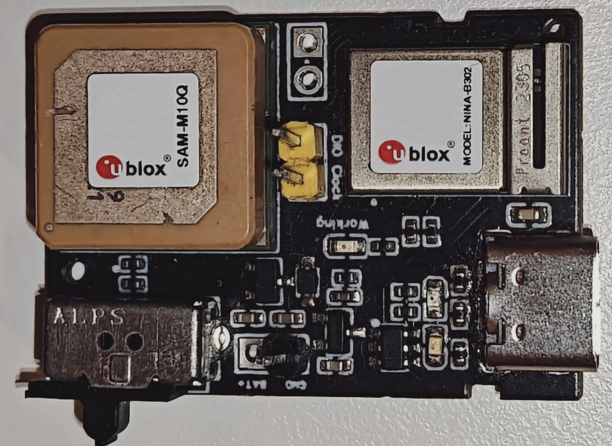

# BLETracker

Copyright (C) 2026 Lancelot MEI

BLETracker is a Zephyr-based firmware project for a Bluetooth Low Energy tracker built around a Nordic nRF52840 platform and a u-blox SAM-M10 GNSS module. The repository also contains the associated board definition files and schematic design files.

## Overview

BLETracker is a portable external GNSS positioning device designed to work with a smartphone over BLE. It augments the phone’s built-in GNSS by offloading positioning to a dedicated low-power device.

Compared to relying solely on the phone, BLETracker focuses on delivering longer tracking duration and more stable positioning, while the phone remains the main interface for display, storage, and connectivity.

The system focuses on three practical goals:

- **Longer tracking time**: GNSS is handled by a dedicated device, reducing continuous GNSS load on the phone.
- **More stable positioning**: a standalone GNSS module with better antenna conditions can provide more consistent fixes during movement.
- **Simple integration**: location data is transmitted via BLE and can be consumed by a mobile app or logging system.

## Why this project

- Continuous GNSS on a phone drains battery quickly.
- Antenna constraints and device placement affect stability.
- Limited control over GNSS behavior for logging use cases.

BLETracker acts as an external GNSS sensor over BLE, offloading positioning while the phone handles UI and data.

## Design considerations

- **Low-power system design**: nRF52840 manages BLE communication and system control with efficient scheduling.
- **Dedicated GNSS module**: u-blox SAM-M10 is used for its power efficiency and reliable positioning performance.
- **Separation of concerns**: GNSS acquisition, BLE transport, and application logic are decoupled.
- **Portable form factor**: intended to be carried or attached during activity.

## Potential use cases

- Long-duration walking, hiking, or cycling with continuous track logging
- External GNSS receiver for mobile applications
- Lightweight positioning device for custom data collection
- Development platform for GNSS-related experiments

## Hardware

- Schematics and PCB design files are located under `hardware/` (KiCad sources).


## Repository layout

- `src/`: application firmware, BLE services, GNSS/UBX handling, and hardware glue.
- `boards/IMYTH/BLETracker/`: custom Zephyr board definition for the target hardware.
- `docs/`: project notes and design documents.
- `hardware/`: KiCad source files (converted from EasyCAD, need adjust) and related hardware assets.

## Build notes

This project is intended to be built with Zephyr and a configured Zephyr SDK / toolchain environment.

Typical build flow:

```sh
west build -b BLETracker/nrf52840
```

You may need to adjust the board target or workspace layout to match your local Zephyr setup.

## GitHub readiness notes

- `build/` and local editor state are intentionally ignored.
- `.vscode/` contains machine-local IDE configuration and is not required to build the project.
- `src/ubx_messages_header.h` is a generated u-blox header and retains its original upstream notice.

## License

Unless a file states otherwise, this repository is licensed under `GPL-2.0-only`. See [LICENSE](LICENSE).

Third-party or generated files may carry their own notices and should be treated according to the license text embedded in those files.
